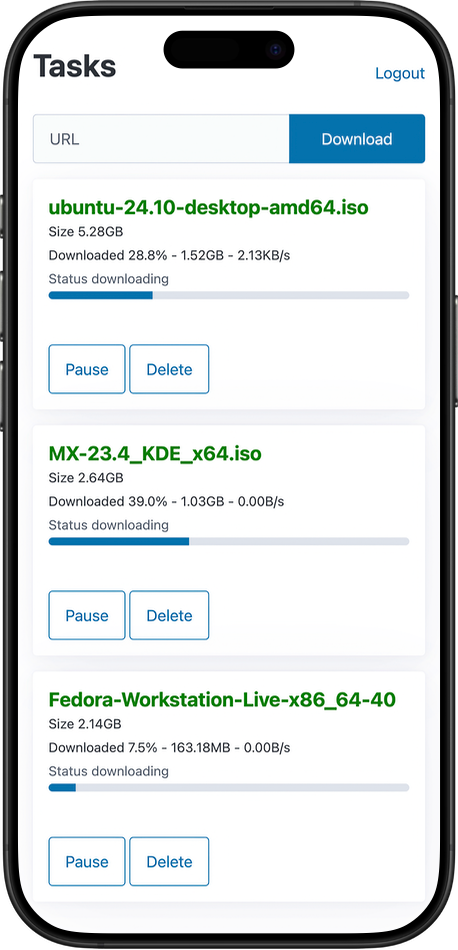

# Downtown - Mobile friendly Synology Download Station web UI

[Downtown](https://github.com/lazydevorg/downtown) is a mobile friendly web UI for the excellent
[Synology Download Station](https://www.synology.com/en-us/dsm/packages/DownloadStation).

## Build and run

```shell
# set synology nas ip and port
export DOWNLOAD_STATION_HOST=127.0.0.1:5001
```

```shell
# set listening address and port (optional)
export ADDR=localhost:4000

# set dev mode for debug logging (optional)
export DEV_MODE=true
```

```shell
go build ./cmd/downtown
./downtown
```

Optionally you can build it using the Dockerfile included.

## Screenshot


